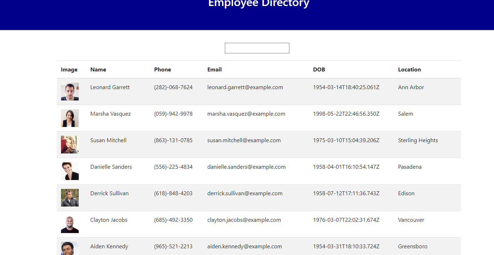

# React-Employees
This application uses React to create a directory of employees. In addition to making an API call to a directory of employees and returning the results as a table, this application allows users to search for specific employees via a search bar. I was provided a User Story, but was not provided any starter code.

## User Story

* As a user, I want to be able to view my entire employee directory at once so that I have quick access to their information.

## Dependencies
This application has the following dependencies:
* axios
* bootstrap
* react
* react-dom
* react-scripts

## Deployment
[The site is deployed via Netlify](https://goofy-dijkstra-bd20f8.netlify.app)

  
